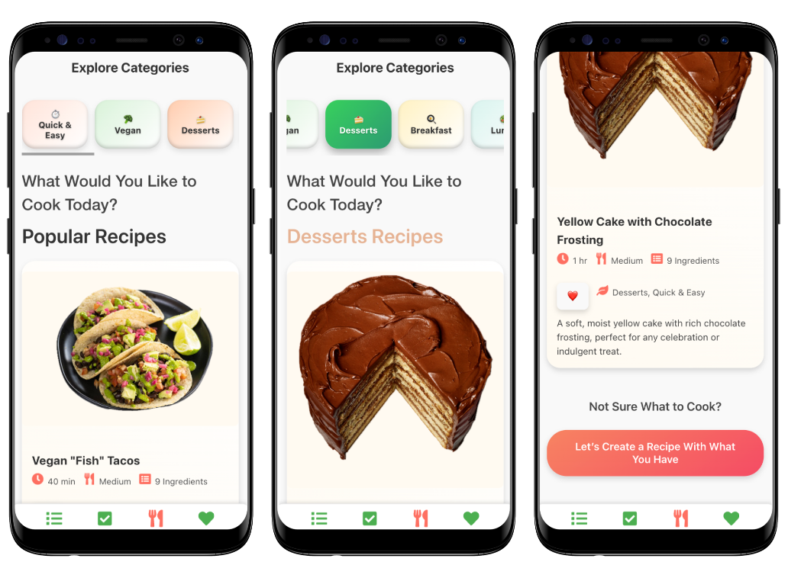

# CPSC481: CookPal

#### Example Login Credentials
UserName: Moe@gmail.com
Password: 1234567

> [!NOTE]
> Please click inspect and hit toggle device emulation button the choose dimensions to Samsung Galaxy S8+.

# Group Information
> Group: T04-T2
### Group Members

| Team Member         | UCID      |
|---------------------|-----------|
| Sadia Khandaker     | 30099679  |
| Mahfuz Alam         | 30142265  |
| Mohamad Hammoud     | 30146854  |
| Sam Fasakin         | 30161903  |

# Important:
All of the code was originally written by us, with most of it provided to ChatGPT for optimization and styling adjustments.

# Instructions

### Step 1: Log In or Register
1. Open the application.
2. On the login screen, enter the credentials provided above:
- **Username**: Moe@gmail.com
- **Password**: 1234567
3. If you do not have an account, you can choose to register by clicking the **Register** button.

### Step 2: Home / Categories Page
Once logged in, you will be directed to the **Home** page (also known as the **Categories page**).
1. Here, you will see a selection of popular recipes, along with chips (buttons) for various categories.
2. You can choose a category by clicking on one of the category chips. Once selected, the page will refresh to show you a list of recipes related to the chosen category.

### Step 3: Ingredient Selection for Recipe Creation
If you're not sure what you're craving and only know what ingredients you have, scroll to the bottom of the Categories page and click on **"Let's create a recipe with what you have"**. This will direct you to the **Ingredient Selection page**.

1. On the Ingredient Selection page, you will see a list of ingredients that you can select.
2. For demonstration purposes, please select the following 5 ingredients:
- **Avocados**
- **Tortillas**
- **Soy Sauce**
- **Sriracha**
- **Corn Starch**

1. **Note**: The button to get the recipe will be disabled until you have selected all 5 ingredients.
2. As you select ingredients, a chip will pop up next to each selected item, and the recipe list will update to show only those recipes that can be made with the selected ingredients.
3. Any recipe that is no longer relevant will be grayed out.

### Step 4: Recipe Generation
Once all 5 ingredients are selected, the **Get Recipe** button will become enabled. Click on this button to view a recipe generated from the selected ingredients.

### Step 5: Recipe Page
Once you click on a recipe from the list, you will be directed to the **Recipe Page**. This page provides more detailed information about the recipe compared to the initial recipe card. 
1. On the recipe page, you will find:
- A **detailed description** of the recipe.
- A list of all **ingredients** along with their **corresponding quantities** required for the recipe.
2. **Scroll to the bottom** of the recipe page, and you will see a **Cook Now** button.

### Step 6: Cooking Instructions
Click on the **Cook Now** button, and you will be directed to the **Cooking Instructions Page**. This page provides step-by-step cooking instructions.
1. Each step will have a **timer** embedded so you can track your progress as you follow the instructions.
2. A **stepper** at the top will visually indicate which step you are currently on. This makes it easy to follow the instructions and ensure you are on the right track.
3. You will have the option to **pause** or **restart** the timer during any step, giving you full control over the cooking process.
4. Additionally, you can navigate to the **next** or **previous** step by using buttons at the bottom of the page, allowing for easy back-and-forth navigation.
5. Once you have completed the final step, you will see a **Finish Cooking** button. Clicking this will allow you to rate the recipe you just made. You will also have the option to add the recipe to your **favourites** or return to the **home page**.

# Resolution
This app has been optimized to work best on a Samsung S8+, which has a resolution of 360px x 740px. However, it would work well with most phones.
